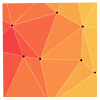
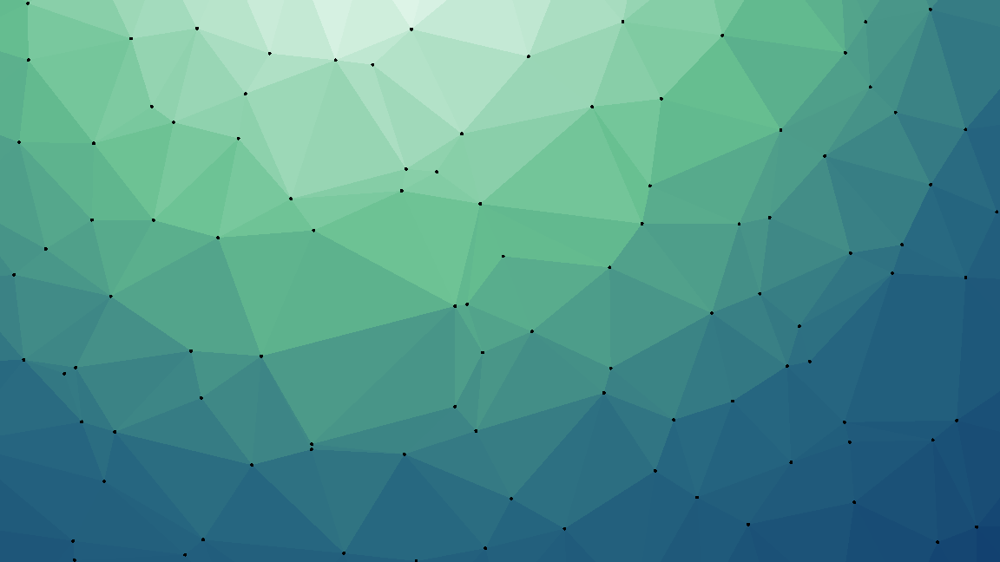
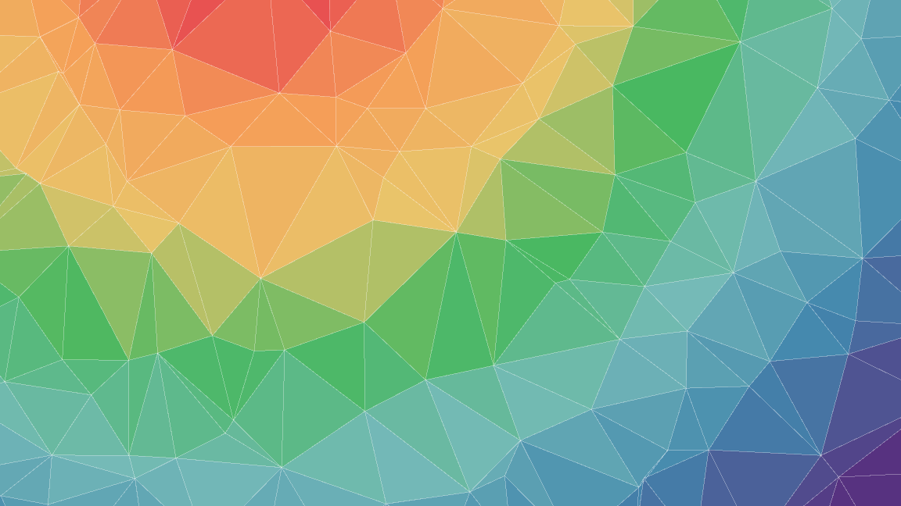
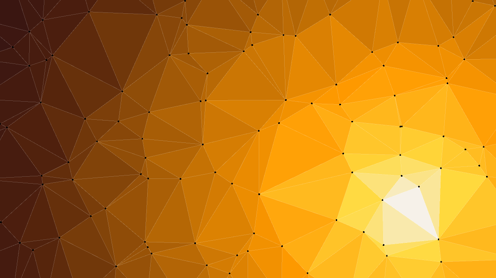

# </img> Triangular patterns
### A simple engine for creating your own live triangular animations

#### --------------------------------- Features ---------------------------------
- created on Godot Engine 4.4
- custom color palettes
- animation of color palettes
- interaction with points and light
- implemented the Delaunay triangulation algorithm
- uses multithreading to increase speed
- fully customizable

### Mint patterns
  
### Rainbow patterns
  
### Desert patterns
  
